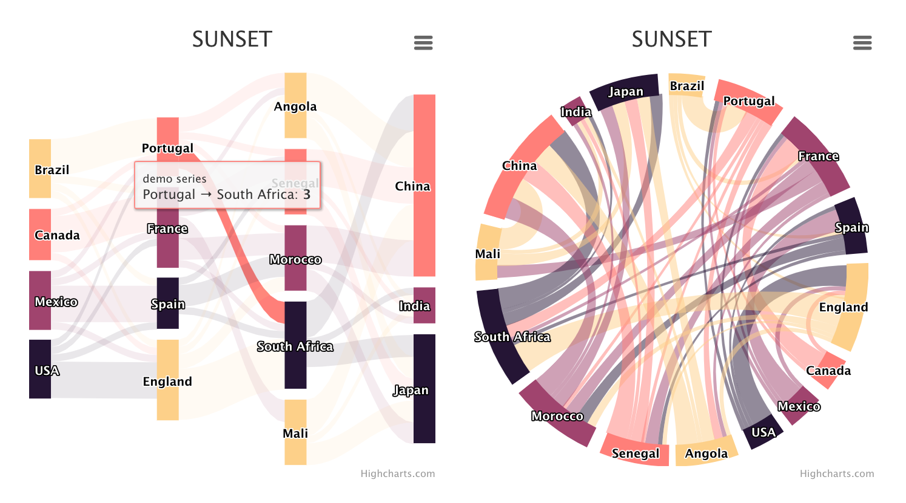

<!-- README.md is generated from README.Rmd. Please edit that file -->

# 'sankeywheel': Create Dependency Wheels and Sankey Diagrams

Dependency wheels and sankey diagrams can be drawn by many R Packages, such as [circlize](https://github.com/jokergoo/circlize), [networkD3](http://christophergandrud.github.io/networkD3/), and [ggalluvial](https://github.com/corybrunson/ggalluvial). These packages are very powerful and easy to use, so why bother to write another duplicate package? As we can see, there are some relationships exist between dependency wheels and sankey diagrams. So why not combined these two types of charts into one R function. At the same time, it would be great to add a little interactivity to the graph. ['Highcharts'](http://www.highcharts.com/), a commercial javascript charting library, can help me realize these ideas. By binding R functions and the 'Highcharts' charting library, 'sankeywheel' package provides a simple way to draw dependency wheels and sankey diagrams.

First, you can install it from `CRAN` or `GitHub`:

```r
devtools::install_github('czxa/sankeywheel', build_vignettes = TRUE)
# or just use git
devtools::install_git("https://github.com/czxa/sankeywheel.git", build_vignettes = TRUE)

# CRAN
install.packages("sankeywheel")
```

## Basic Usages

First, load `sankeywheel` package:

```r
library(sankeywheel)
#> Highcharts (www.highcharts.com) is a Highsoft software product which is
#> not free for commercial and governmental use
```

There is a demo dataset built in this R packages.

`sankeydf` is a tibble data frame with 46 rows and 3 variables:

```r
DT::datatable(sankeydf)
```


To draw dependency wheels and sankey diagrams, you need there vector, two character vectors and one numeric vector: from, to and weight.

For dependency wheels:

``` r
sankeywheel(from = sankeydf$from,
            to = sankeydf$to,
            weight = sankeydf$weight,
            type = "dependencywheel", 
            width = "100%")
```


For sankey diagrams:

``` r
sankeywheel(from = sankeydf$from,
            to = sankeydf$to,
            weight = sankeydf$weight,
            type = "sankey", 
            width = "100%")
```


## Theme parameter

I hate complex codes, so I built some themes in this package. Just change theme parameter, you can render charts in different apperances.

If there are multiple charts created by this package in a RMarkdown document, use topic parameters carefully, because these charts may interfere with each other.

The default theme is `sandsignika`. There are other eight theme you can choose: darkgreen/darkblue/avocado/darkunica/gray/gridlight/grid/sunset:

```r
library(manipulateWidget)
combineWidgets(
  sankeywheel(from = sankeydf$from,
            to = sankeydf$to,
            weight = sankeydf$weight,
            type = "sankey", 
            width = "100%",
            theme = "sunset", 
            title = "SUNSET"),
  sankeywheel(from = sankeydf$from,
            to = sankeydf$to,
            weight = sankeydf$weight,
            type = "dependencywheel", 
            width = "100%", 
            theme = "sunset", 
            title = "SUNSET"),
  byrow = TRUE, ncol = 2, width = "100%", height = "300px"
)
```



## Other parameters

Here is a complete example:

``` r
sankeywheel(from = sankeydf$from,
            to = sankeydf$to,
            weight = sankeydf$weight,
            type = "dependencywheel", 
            seriesName = "Random data: ",
            width = "100%", 
            height = "400px",
            theme = "sunset", 
            title = "SUNSET",
            titleAlign = "center",
            titleSize = "18px",
            titleColor = "black",
            subtitle = "czxa.top",
            subtitleAlign = "center",
            subtitleSize = "14px",
            subtitleColor = "black")
```


## Use it in ‘RMarkdown’ and ‘Shiny’ Apps

Here is a very simple ‘shiny’ example:

```r
dir <- system.file("examples", "sankeywheel", package = "sankeywheel")
setwd(dir)
shiny::shinyAppDir(".")
```

## Licence

sankeywheel has a dependency on Highcharts, a commercial JavaScript charting library. Highcharts offers both a commercial license as well as a free non-commercial license. Please review the licensing options and terms before using this software, as the sankeywheel license neither provides nor implies a license for Highcharts.

Highcharts (http://highcharts.com) is a Highsoft product which is not free for commercial and Governmental use.

## Acknowledgements

+ [jbkunst/highcharter](https://github.com/jbkunst/highcharter)

-----

<h4 align="center">

License

</h4>

<h6 align="center">

MIT © czxa.top

</h6>
